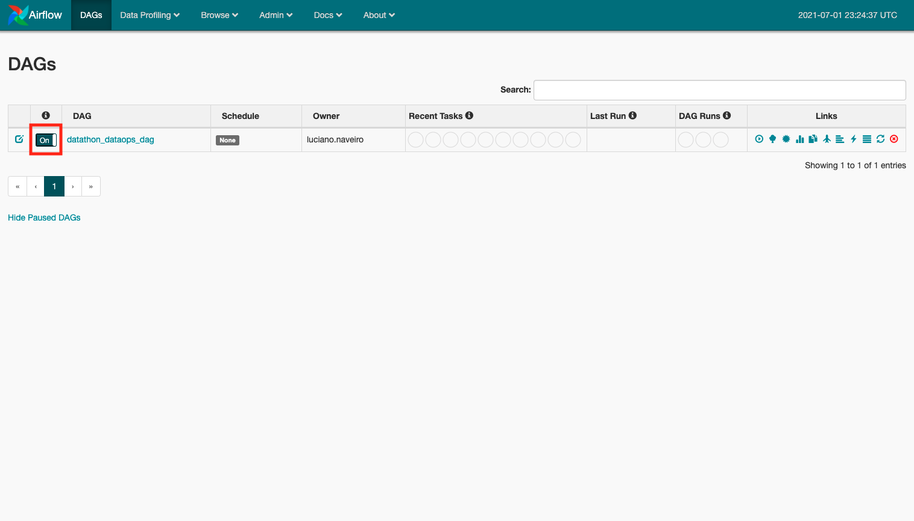
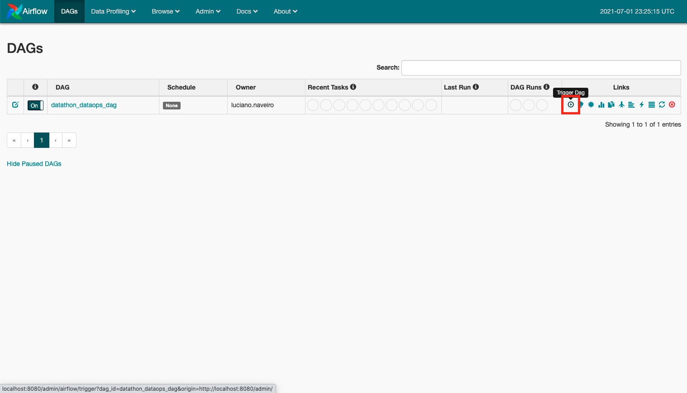
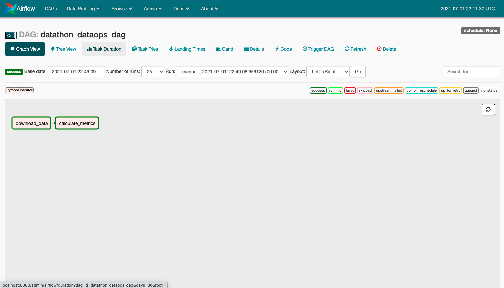

# **Telecom Datathon 2021: Data Ops**

En este repositorio se encuentran los archivos necesarios para ejecutar y completar el desafío del **Telecom Datathon 2021: Data Ops**.

Una consideración es que se debe setear la memoria de Docker en al menos 8gb para que el proceso corra bien.
Aca estan los pasos a seguir para ejecutar el proyecto:

```
$ docker build -t airflow .
$ docker run --rm --name datathon-dataops -p 8080:8080 -v $PWD:/usr/local/airflow airflow
```

donde:
- `--rm` es una buena práctica automáticamente remover el container
- `--name` es el nombre con el que nos vamos a referir al container una vez que esta corriendo
- `-t` es el tag que le ponemos al container , para luego identificarla cuando lo querramos correr
- `-p` son los puertos que vamos a mapear de nuestra computadora y del container
- `-v` son los volumenes vamos a mapear de nuestra computadora y del container, asi podemos usar nuestro script y otener el output del proceso (el archivo `resultados.csv`)

La imágen de Docker que utilizo en este proyecto, esta basada en la imagen que se encuentra en este [repositorio](https://github.com/puckel/docker-airflow).

Una vez que el container esta levantado, nos dirigimos a http://localhost:8080/admin/ para ejecutar el proceso.

Una vez ahi, debemos prender el DAG y ejecutarlo, como se muestra en las siguientes imagenes.:





Una vez que haya corrido, vamos a tener la siguiente vista en el _Graph View_:




Cuando ya haya terminado, vamos a tener el archivo `resultados.csv` en el directorio, que es el mismo archivo que se encuentra en `/usr/local/airflow/resultados.csv`. Lo tenemos tambien en nuestro directorio debido a que mapeamos los directorios cuando corrimos el container.

Al concluir el proceso, se puede parar el container:
```
$ docker stop datathon-dataops
```

## **Tratamiento de NULLs**
Se realizo el siguiente tratamiento de los NULLs en los datos:
- `runtimeMinutes`: se removieron los NULLs para calcular el promedio
- `directors`: se removieron tanto para calcular la cantidad unica de directores, como para considerar a los top directores por año-genero
- `writers`: se removieron para calcular la cantidad unica de escritores

En el archivo final `resultados.csv`, no se removieron los géneros en NULL. Por lo que hay ciertas combinaciones de años y generos NULL.

